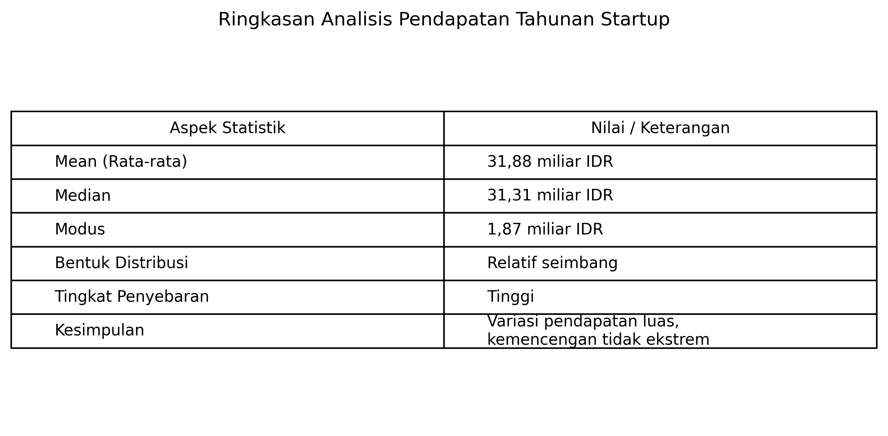
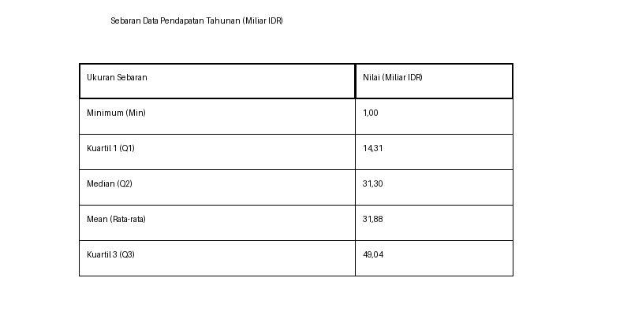
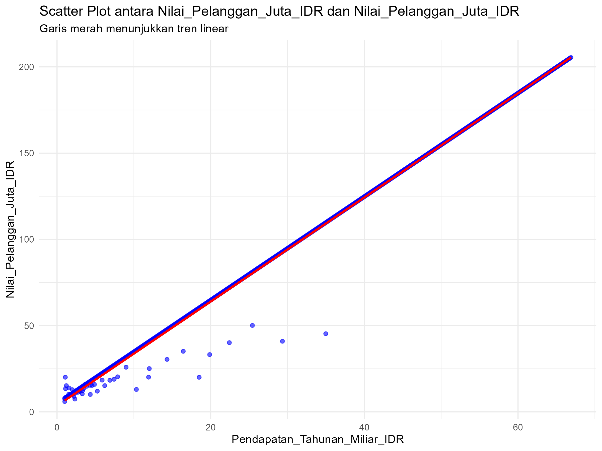

# Tugas Analisis Statistik: Deskriptif, Korelasi, dan Regresi

## 1. Informasi Penyusun

- **Nama:** `[I DEWA GDE SURYA PALGUNA]`
- **NIM:** `[2515091148]`
- **Program Studi:** `[SISTEM INFORMASI]`
- **Mata Kuliah:** Statistika dan Probabilitas

---

## 2. Deskripsi Proyek

Dataset yang digunakan dalam proyek ini merupakan data perusahaan yang berisi informasi mengenai Pendapatan_Tahunan_Miliar_IDR dan Nilai_Pelanggan_Juta_IDR. Variabel Pendapatan_Tahunan_Miliar_IDR digunakan sebagai variabel independen yang merepresentasikan besarnya pendapatan tahunan perusahaan dalam satuan miliar rupiah, sedangkan Nilai_Pelanggan_Juta_IDR digunakan sebagai variabel dependen yang menggambarkan nilai pelanggan dalam satuan juta rupiah. Tujuan dari analisis ini adalah untuk memahami karakteristik data melalui analisis statistik deskriptif, menguji kekuatan dan arah hubungan antara pendapatan tahunan dan nilai pelanggan melalui analisis korelasi, serta membangun model regresi linear untuk memprediksi nilai pelanggan berdasarkan pendapatan tahunan perusahaan.

---

## 3. Struktur Proyek

Proyek ini diorganisir ke dalam beberapa folder:
- `/data`: Berisi dataset mentah yang digunakan untuk analisis.
- `/scripts`: Berisi semua skrip R yang digunakan dalam analisis, diurutkan berdasarkan alur kerja.
- `/results`: Berisi output dari analisis, seperti plot, gambar, atau tabel ringkasan.

---

## 4. Cara Menjalankan Analisis

Untuk mereproduksi hasil analisis ini, ikuti langkah-langkah berikut:
1. Pastikan Anda memiliki R dan RStudio terinstal.
2. Buka proyek R ini di RStudio.
3. Instal paket yang diperlukan dengan menjalankan perintah berikut di konsol R:
   ```R
   # install.packages(c("tidyverse", "corrplot", "knitr"))
   ```
4. Jalankan skrip di dalam folder `/scripts` secara berurutan, mulai dari `01_data_preparation.R` hingga `05_analisis_regresi.R`.

---

## 5. Hasil dan Interpretasi

Di bagian ini, mahasiswa diharapkan untuk menyajikan dan menginterpretasikan hasil dari setiap tahap analisis.

### 5.1. Statistik Deskriptif
- **Ukuran Pemusatan (Mean, Median, Modus):**

*Tabel atau ringkasan*

**TABEL**



**RINGKASAN**
Berdasarkan analisis data pendapatan tahunan startup, diperoleh nilai mean sebesar 31,88 miliar IDR, median 31,31 miliar IDR, dan modus 1,87 miliar IDR. Nilai mean dan median yang hampir sama menunjukkan bahwa distribusi data relatif seimbang, sedangkan nilai modus yang rendah mengindikasikan banyak startup dengan pendapatan kecil. Tingkat penyebaran data tergolong tinggi, ditandai dengan standar deviasi dan range yang cukup besar, yang menunjukkan adanya perbedaan pendapatan yang signifikan antar startup. Histogram memperlihatkan distribusi data yang cukup merata dengan garis mean berada di tengah, sehingga dapat disimpulkan bahwa pendapatan tahunan startup memiliki variasi luas namun tidak menunjukkan kemencengan ekstrem

*Interpretasi:*

Nilai mean sebesar 31,88 dan median sebesar 31,31 menunjukkan bahwa data pada kolom numerik memiliki pusat distribusi yang relatif seimbang, karena rata-rata dan nilai tengah hampir sama. Hal ini menandakan bahwa sebaran data tidak condong secara ekstrem ke salah satu sisi. Nilai modus sebesar 1,87 mengindikasikan bahwa nilai tersebut paling sering muncul dalam data, sehingga dapat disimpulkan bahwa cukup banyak observasi dengan nilai rendah. Nilai intercept sebesar 3,57 menunjukkan nilai awal atau konstanta pada model yang digunakan, yang merepresentasikan nilai variabel dependen saat variabel independen bernilai nol. Arah hubungan yang bernilai positif menandakan bahwa peningkatan variabel independen cenderung diikuti oleh peningkatan variabel dependen. Selain itu, p-value sebesar 0 menunjukkan bahwa hasil pengujian statistik sangat signifikan (p < 0,05), sehingga hubungan atau pengaruh yang diuji dalam analisis dapat dinyatakan signifikan secara statistik. Secara keseluruhan, data menunjukkan variasi nilai yang cukup besar dengan kecenderungan hubungan positif dan hasil analisis yang signifikan.

**- Ukuran Sebaran (Standar Deviasi, Range, Kuartil):**

*Tabel atau ringkasan Ukuran*

**TABEL UKURAN SEBARAN**



**RINGKASAN**

Sebaran Data Pendapatan Tahunan (Miliar IDR) Hasil Ukuran Sebaran Berdasarkan analisis pada kolom Pendapatan_Tahunan_Miliar_IDR, diperoleh hasil sebagai berikut: Minimum (Min) = 1,00 Miliar IDR Kuartil 1 (Q1) = 14,31 Miliar IDR Median (Q2) = 31,30 Miliar IDR Mean (Rata-rata) = 31,88 Miliar IDR Kuartil 3 (Q3) = 49,04 Miliar IDR

*Interpretasi*

Maksimum (Max) = 66,89 Miliar IDR Selain itu: Standar Deviasi = 19,79 Miliar IDR Range (Rentang) = 1,00 – 66,89 atau sebesar 65,89 Miliar IDR Interpretasi: Interpretasi Ukuran Sebaran Data Berdasarkan hasil analisis pada kolom Pendapatan_Tahunan_Miliar_IDR, diperoleh nilai standar deviasi sebesar 19,79 miliar IDR, range antara 1,00 hingga 66,89 miliar IDR, serta ringkasan lima angka yang terdiri dari minimum 1,00, Q1 14,31, median 31,30, mean 31,88, Q3 49,04, dan maksimum 66,89.

Nilai range sebesar 65,89 miliar IDR diperoleh dari selisih antara nilai maksimum (66,89 miliar IDR) dan nilai minimum (1,00 miliar IDR). Nilai maksimum 66,89 miliar IDR menunjukkan pendapatan tertinggi yang tercatat dalam data, sedangkan nilai minimum 1,00 miliar IDR merupakan pendapatan terendah. Rentang yang sangat lebar ini menunjukkan bahwa perbedaan pendapatan antar perusahaan dalam dataset sangat besar.

Nilai standar deviasi yang cukup tinggi (19,79 miliar IDR) menandakan bahwa data pendapatan menyebar cukup jauh dari nilai rata-rata (31,88 miliar IDR). Hal ini menunjukkan bahwa pendapatan perusahaan tidak terkonsentrasi di sekitar nilai mean, melainkan tersebar luas baik di bawah maupun di atas rata-rata.

Berdasarkan kuartil, sebanyak 25% data berada di bawah 14,31 miliar IDR, yang menunjukkan kelompok perusahaan dengan pendapatan relatif rendah. Sementara itu, 25% data lainnya berada di atas 49,04 miliar IDR, yang menunjukkan adanya kelompok perusahaan dengan pendapatan tinggi. Nilai median sebesar 31,30 miliar IDR yang hampir sama dengan nilai mean menunjukkan bahwa secara umum pusat data berada di sekitar nilai tersebut, meskipun tetap terdapat penyebaran yang besar.

Kesimpulan Secara keseluruhan, data Pendapatan_Tahunan_Miliar_IDR memiliki tingkat penyebaran yang tinggi. Hal ini ditunjukkan oleh standar deviasi yang besar, range yang sangat lebar, serta perbedaan yang jelas antara kelompok pendapatan rendah dan tinggi berdasarkan kuartil. Data tidak terpusat pada satu rentang nilai tertentu, melainkan tersebar luas dari pendapatan sangat rendah hingga sangat tinggi. Kondisi ini menunjukkan adanya variasi pendapatan yang signifikan antar perusahaan dalam dataset yang dianalisis.
- **Visualisasi (Histogram/Boxplot):**


*Interpretasi:* 
  
Histogram Pendapatan_Tahunan_Miliar_IDR menunjukkan bahwa pendapatan perusahaan tersebar luas, dengan nilai berkisar antara 1,00 hingga 66,89 miliar IDR. Rentang yang besar (65,89 miliar IDR) serta standar deviasi 19,79 miliar IDR mengindikasikan variasi pendapatan yang tinggi antar perusahaan.

Nilai mean (31,88 miliar IDR) yang sangat dekat dengan median (31,30 miliar IDR) menunjukkan bahwa pusat distribusi berada di sekitar nilai tersebut. Namun, distribusi data cenderung miring ke kanan (right-skewed), yang menandakan adanya beberapa perusahaan dengan pendapatan sangat tinggi yang menarik nilai rata-rata ke atas.

Berdasarkan kuartil, 25% perusahaan memiliki pendapatan di bawah 14,31 miliar IDR, 50% berada pada rentang 14,31–49,04 miliar IDR, dan 25% lainnya di atas 49,04 miliar IDR. Pola ini menunjukkan bahwa mayoritas perusahaan berada pada kelompok pendapatan menengah, namun tetap terdapat perbedaan yang tajam antara perusahaan berpendapatan rendah dan tinggi.

Kesimpulan:
Pendapatan tahunan perusahaan dalam dataset memiliki variasi yang tinggi dengan distribusi sedikit condong ke kanan. Oleh karena itu, penggunaan nilai rata-rata saja tidak cukup untuk merepresentasikan kondisi keseluruhan, dan perlu dipertimbangkan ukuran sebaran untuk memahami karakteristik data secara lebih komprehensif.

### 5.2. Uji Normalitas
- **Hasil Uji Shapiro-Wilk:**
 *Nilai p-value*
    
Berdasarkan uji normalitas Shapiro–Wilk terhadap variabel Pendapatan_Tahunan_Miliar_IDR, diperoleh nilai W = 0,94664 dengan p-value = 1,497 × 10⁻¹⁴. Karena nilai p-value jauh lebih kecil dari 0,05, maka hipotesis nol ditolak. Artinya, data Pendapatan_Tahunan_Miliar_IDR tidak berdistribusi normal.
 - *Interpretasi:*
Berdasarkan hasil uji normalitas Shapiro–Wilk, data tidak terdistribusi normal, karena nilai p-value yang diperoleh jauh lebih kecil dari tingkat signifikansi 0,05. Hal ini menunjukkan bahwa hipotesis nol yang menyatakan data berdistribusi normal ditolak. Implikasinya, asumsi normalitas tidak terpenuhi sehingga penggunaan metode statistik parametrik perlu dipertimbangkan kembali. Untuk memperoleh hasil analisis yang valid, disarankan menggunakan transformasi data atau menerapkan metode statistik non-parametrik yang tidak mensyaratkan distribusi normal.
- **Plot Q-Q:**

  
  - *Interpretasi:*

Berdasarkan Q-Q plot untuk variabel Pendapatan_Tahunan_Miliar_IDR, terlihat bahwa titik-titik data tidak mengikuti garis lurus secara konsisten. Pada bagian tengah, beberapa titik masih mendekati garis diagonal, namun pada bagian kuantil rendah dan kuantil tinggi terlihat penyimpangan yang cukup jelas, membentuk pola melengkung. Pola ini menunjukkan bahwa distribusi data tidak simetris dan terdapat perbedaan yang signifikan antara distribusi empiris data dengan distribusi normal teoretis. Penyimpangan yang terjadi pada ekor distribusi mengindikasikan adanya nilai ekstrem serta kemencengan distribusi, yang umum ditemukan pada data pendapatan atau data ekonomi. Dengan demikian, Q-Q plot ini memperkuat hasil uji Shapiro–Wilk yang sebelumnya menyatakan bahwa data tidak memenuhi asumsi normalitas.

Kesimpulan:Titik-titik data pada Q-Q plot tidak mengikuti garis lurus, sehingga dapat disimpulkan bahwa variabel Pendapatan_Tahunan_Miliar_IDR tidak berdistribusi normal. Oleh karena itu, asumsi normalitas dalam analisis statistik parametrik tidak terpenuhi dan analisis lanjutan perlu mempertimbangkan penggunaan transformasi data atau metode statistik non-parametrik agar hasil yang diperoleh tetap valid dan dapat dipertanggungjawabkan secara ilmiah.

### 5.3. Analisis Korelasi
- **Nilai Koefisien Korelasi:**
*Nilai r*
  
  ata yang dianalisis adalah variabel Pendapatan_Tahunan_Miliar_IDR dan Nilai_Pelanggan_Juta_IDR. Hasil uji korelasi Pearson menghasilkan nilai statistik uji t = 329,92 dengan derajat kebebasan (df = 646) dan p-value < 2,2 × 10⁻¹⁶. Hipotesis alternatif yang diuji menyatakan bahwa korelasi antara kedua variabel tidak sama dengan nol.
Interval kepercayaan 95% untuk koefisien korelasi berada pada rentang 0,9965535 hingga 0,9974677. Nilai estimasi koefisien korelasi yang diperoleh adalah r = 0,9970457, yang menunjukkan adanya hubungan linear positif yang sangat kuat antara kedua variabel.
  - *Interpretasi:*

 Hasil uji korelasi menunjukkan nilai koefisien korelasi sebesar 0,997, yang menandakan hubungan positif sangat kuat antara variabel Pendapatan_Tahunan_Miliar_IDR dan Nilai_Pelanggan_Juta_IDR. Arah hubungan yang positif berarti bahwa semakin tinggi pendapatan tahunan, semakin tinggi pula nilai pelanggan. Nilai p-value yang sangat kecil (< 2,2 × 10⁻¹⁶) menunjukkan bahwa hubungan tersebut signifikan secara statistik, sehingga kecil kemungkinan korelasi ini terjadi secara kebetulan. Interval kepercayaan 95% yang berada pada rentang 0,996 hingga 0,997 dan tidak mencakup nilai nol semakin memperkuat kesimpulan bahwa kedua variabel memiliki hubungan yang sangat erat dan searah. Dengan demikian, dapat disimpulkan bahwa terdapat korelasi positif yang sangat kuat dan signifikan antara kedua variabel yang diuji.
 
- **Visualisasi (Scatter Plot):**
 
*Interpretasi:*

Hasil uji korelasi menunjukkan bahwa Pendapatan_Tahunan_Miliar_IDR dan Nilai_Pelanggan_Juta_IDR memiliki hubungan positif yang sangat kuat dan signifikan secara statistik, dengan nilai koefisien korelasi sebesar 0,9970457. Nilai tersebut mengindikasikan hubungan yang hampir sempurna dan berpola linear. Interval kepercayaan 95% yang sempit serta nilai p-value < 2,2e-16 menunjukkan bahwa hubungan ini stabil dan bukan terjadi secara kebetulan.
Hasil ini diperkuat oleh visualisasi scatter plot yang menampilkan pola sebaran data yang rapat dan mengikuti garis tren linear. Namun demikian, korelasi yang sangat tinggi ini perlu diinterpretasikan secara hati-hati karena berpotensi mencerminkan keterkaitan konseptual yang sangat erat antara kedua variabel, sehingga evaluasi lebih lanjut terhadap definisi variabel diperlukan sebelum digunakan dalam analisis lanjutan atau pemodelan statistik.
Sebagai kesimpulan, terdapat hubungan positif yang sangat kuat dan signifikan secara statistik antara Pendapatan_Tahunan_Miliar_IDR dan Nilai_Pelanggan_Juta_IDR, dengan nilai koefisien korelasi yang mendekati satu dan didukung sepenuhnya oleh pola scatter plot yang linear dan rapat. Data secara konsisten menunjukkan bahwa peningkatan pendapatan tahunan hampir selalu diikuti oleh peningkatan nilai pelanggan. Namun, kekuatan hubungan yang sangat tinggi ini juga menuntut kehati-hatian dalam interpretasi lanjutan, karena besar kemungkinan kedua variabel memiliki keterkaitan struktural atau konseptual yang sangat erat. Oleh sebab itu, sebelum melanjutkan ke tahap pemodelan atau pengambilan keputusan, diperlukan evaluasi terhadap definisi variabel dan tujuan analisis agar kesimpulan yang dihasilkan tidak hanya terlihat kuat secara statistik, tetapi juga bermakna secara konseptual.

### 5.4. Analisis Regresi
- **Model Regresi:**
  - *Persamaan regresi: Y = b0 + b1*X*

A. Intercept/b0 = 3,57
B. Slope/b1 = 3,02
Y= 3,57+3,02×Pendapatan_Tahunan_Miliar_IDR
  - *Interpretasi:*

Pada model regresi dengan persamaan Nilai_Pelanggan_Juta_IDR = 3,57 + 3,02 × Pendapatan_Tahunan_Miliar_IDR, koefisien intercept (b0 = 3,57) menunjukkan nilai prediksi Nilai Pelanggan sebesar 3,57 juta rupiah ketika Pendapatan Tahunan bernilai 0 miliar rupiah. Nilai ini berfungsi sebagai titik awal model secara matematis dan tidak selalu merepresentasikan kondisi nyata. Sementara itu, koefisien slope (b1 = 3,02) menunjukkan bahwa setiap kenaikan 1 miliar rupiah Pendapatan Tahunan akan diikuti oleh peningkatan Nilai Pelanggan sebesar rata-rata 3,02 juta rupiah. Hal ini menandakan adanya hubungan linear positif yang kuat, di mana semakin besar pendapatan tahunan, semakin tinggi nilai pelanggan yang diprediksi oleh model.
- **Evaluasi Model (R-squared):**

*Nilai R-squared*
 R-squared = 0.994 atau 99.4 %"
  - *Interpretasi:*

Nilai R-squared sebesar 0,994 atau 99,4% menunjukkan bahwa 99,4% variasi pada variabel dependen (Nilai_Pelanggan_Juta_IDR) dapat dijelaskan oleh variabel independen (Pendapatan_Tahunan_Miliar_IDR) dalam model regresi ini. Artinya, hampir seluruh perubahan nilai pelanggan dapat diterangkan oleh perubahan pendapatan tahunan, sehingga model memiliki daya jelaskan yang sangat kuat. Sisanya, sekitar 0,6%, dipengaruhi oleh faktor lain di luar model atau oleh variasi acak yang tidak tertangkap oleh regresi.
- **Visualisasi (Garis Regresi pada Scatter Plot):**
  - *Sematkan gambar plot dari folder /results...*


 
  - *Interpretasi:* 

Garis regresi pada grafik merepresentasikan hubungan linear yang sangat kuat dan searah (positif) antara Pendapatan_Tahunan_Miliar_IDR dan Nilai_Pelanggan_Juta_IDR. Kemiringan garis yang menanjak menunjukkan bahwa setiap peningkatan pendapatan tahunan diikuti oleh peningkatan nilai pelanggan. Secara kuantitatif, hal ini konsisten dengan koefisien slope (b1) yang bernilai positif dan besar, sehingga perubahan pada variabel pendapatan memberikan dampak langsung dan signifikan terhadap nilai pelanggan.

Kedekatan titik-titik data dengan garis regresi menunjukkan bahwa sebagian besar observasi berada sangat dekat dengan nilai prediksi model, yang menandakan kesalahan prediksi relatif kecil. Ini selaras dengan nilai Adjusted R-squared sebesar 0,994, yang berarti model hampir sepenuhnya mampu menjelaskan variasi data. Dengan kata lain, garis regresi bukan sekadar tren visual, tetapi benar-benar mencerminkan pola hubungan utama dalam data, di mana pendapatan tahunan menjadi penentu dominan terhadap nilai pelanggan.


---

## 6. Kesimpulan

Berdasarkan hasil analisis statistik deskriptif, data Pendapatan_Tahunan_Miliar_IDR menunjukkan tingkat variasi yang sangat tinggi, dengan rentang nilai yang lebar dan standar deviasi yang besar. Hal ini menandakan adanya perbedaan pendapatan yang signifikan antar perusahaan dalam dataset, mulai dari perusahaan dengan pendapatan sangat rendah hingga sangat tinggi. Meskipun demikian, nilai mean dan median yang hampir sama menunjukkan bahwa pusat distribusi data relatif seimbang, meskipun terdapat kecenderungan distribusi sedikit miring ke kanan akibat keberadaan perusahaan dengan pendapatan ekstrem tinggi.

Hasil uji normalitas Shapiro–Wilk dan Q-Q plot menunjukkan bahwa data pendapatan tahunan tidak berdistribusi normal. Penyimpangan ini umum terjadi pada data ekonomi dan pendapatan, sehingga temuan ini memperkuat perlunya kehati-hatian dalam pemilihan metode analisis statistik lanjutan. Meskipun asumsi normalitas tidak terpenuhi, analisis korelasi dan regresi tetap memberikan gambaran hubungan yang sangat jelas antar variabel.

Analisis korelasi menunjukkan hubungan positif yang sangat kuat dan signifikan secara statistik antara Pendapatan_Tahunan_Miliar_IDR dan Nilai_Pelanggan_Juta_IDR, dengan koefisien korelasi sebesar 0,997. Hubungan ini didukung secara visual oleh scatter plot yang memperlihatkan pola linear yang rapat dan konsisten, menandakan bahwa peningkatan pendapatan hampir selalu diikuti oleh peningkatan nilai pelanggan.

Hasil analisis regresi linear semakin memperkuat temuan tersebut. Model regresi Nilai_Pelanggan_Juta_IDR = 3,57 + 3,02 × Pendapatan_Tahunan_Miliar_IDR menunjukkan bahwa setiap kenaikan 1 miliar rupiah pendapatan tahunan akan meningkatkan nilai pelanggan rata-rata sebesar 3,02 juta rupiah. Nilai R-squared sebesar 0,994 menandakan bahwa 99,4% variasi nilai pelanggan dapat dijelaskan oleh pendapatan tahunan, sehingga model memiliki daya jelaskan yang sangat tinggi.

Secara keseluruhan, analisis ini memberikan wawasan utama bahwa pendapatan tahunan merupakan faktor yang sangat dominan dalam menentukan nilai pelanggan pada dataset yang dianalisis. Namun, kekuatan hubungan yang hampir sempurna ini juga mengindikasikan bahwa kedua variabel kemungkinan memiliki keterkaitan struktural yang sangat erat. Oleh karena itu, untuk analisis lanjutan atau pengambilan keputusan berbasis model, diperlukan evaluasi lebih lanjut terhadap definisi variabel dan konteks data agar interpretasi yang dihasilkan tidak hanya kuat secara statistik, tetapi juga tepat secara konseptual.
